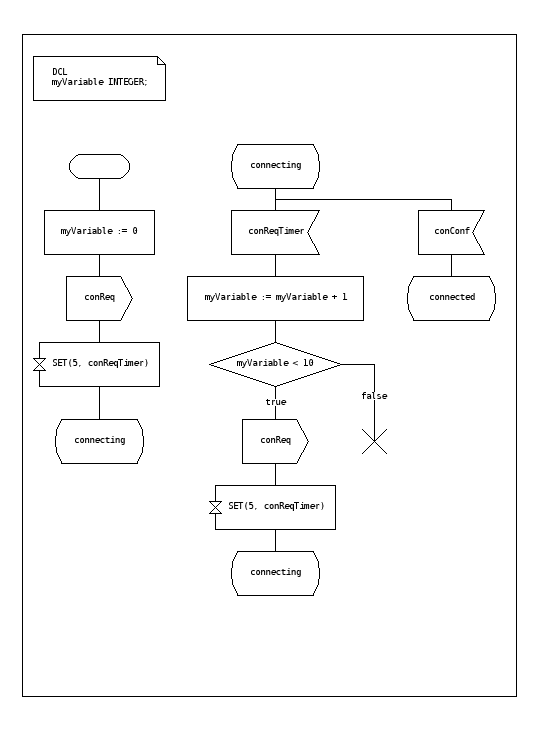

## Распределённая обработка информации и NoSQL СУБД

# Особенности программирования в распределённых средах

### Луцив Дмитрий Вадимович
### ЗАО «Ланит-Терком», СПбГУ

= = = = = = = = = = = = =
# Блокирующий ввод-вывод <!-- .element style="color: blue;" -->
<!-- .slide: data-background="images/5-min-break.jpg" data-background-size="contain" data-background-color="#98090D" -->

- - - - - - - - - - - - -
## Примеры

LibC

    FILE *fp;
    char str[] = "This is tutorialspoint.com";
    fp = fopen("file.txt", "w");
    fwrite(str, 1, sizeof(str), fp);
    fclose(fp);

[Node.JS](https://nodejs.org/api/fs.html#fs_fs_writefilesync_file_data_options)

    var fs = require("fs");
    fs.writeFileSync("c:/autoexec.bat", "format c:", "utf8");

= = = = = = = = = = = = =
# Неблокирующий ввод-вывод <!-- .element style="color: yellow;" -->
<!-- .slide: data-background="images/grok.jpg" -->

- - - - - - - - - - - - -
## Пример I

[LibC](http://man7.org/linux/man-pages/man3/aio_write.3.html)

    #include <aio.h>
    int aio_write(struct aiocb *aiocbp);

---

    aiocb.aio_fildes = fd;
    aiocb.aio_buf = check;
    aiocb.aio_nbytes = BUF_SIZE;
    aiocb.aio_lio_opcode = LIO_WRITE;

    if (aio_read(&aiocb) == -1) {
      printf(TNAME " Error at aio_read(): %s\n",
        strerror(errno));
    exit(2);
    }

    while ((err = aio_error (&aiocb)) == EINPROGRESS)
      // Something useful here...
    ;

- - - - - - - - - - - - -
## Пример II

Node.JS

    fs.readFile('/etc/passwd', function (err, data) {
      if (err) throw err;
      console.log(data);
    });

= = = = = = = = = = = = =
# [Чуть-чуть функционального программирования](http://lisperati.com/) <!-- .element style="color: blue;" -->
<!-- .slide: data-background="images/different.jpg" data-background-size="contain" data-background-color="white" -->

- - - - - - - - - - - - -
## А причём тут функциональное программирование?..

    /* переменная глобальная
       или переменная уровня модуля */
    var fs = require('fs');
    
    function do_work(){
      var t = "Ололо"; // локальная переменная
      fs.writeFile("greeting.txt", t, function(err) {
        // А здесь всё, что дальше
        // И оно должно "таскать" за собой fs, t и err
      });
    }

1. «Таскать» глобальную `fs` и локальные `t` и `err` надо по-разному
2. Изменяемые переменные «таскать» тяжелее; подробности — см. [пробема фунарга](https://en.wikipedia.org/wiki/Funarg_problem)
3. Иногда «таскать» надо далеко и долго — на диск или по сети; иногда вместе с кодом

Многое из этого функциональные языки умеют «из коробки»

- - - - - - - - - - - - -
## Чуть лаконичнее

Пример на [LiveScript](http://livescript.net/)

    fs = require 'fs'
    do_work = !->
      t = "Привет"
      fs.writeFile "greeting.txt", t, (err)!->
        fs.readFile "greeting.txt", (err, content)!->
          if content != t
            throw "WAT"

1. Блоки отступами
2. `!->` — процедура (без `return`), `->` — функция

- - - - - - - - - - - - -
<!-- .slide: data-background="images/deflected-tree.jpg" -->

- - - - - - - - - - - - -
## Чуть прямее

    do_work = !->
      t = "Привет"
      fs.writeFile "greeting.txt", t, (err)!->
        fs.readFile "greeting.txt", (err, content)!->
          if content != t
            throw "WAT"

$$\rightarrow$$

    do_work = !->
      t = "Привет"
      err <-! fs.writeFile "greeting.txt", t
      err, content <-! fs.readFile "greeting.txt"
      if content != t
        throw "WAT"

`<-` также поддерживается в F#, Haskell (при помощи монад) и некоторых других

= = = = = = = = = = = = =
# Наконец-то, простой практический пример
<!-- .slide: data-background="images/atlast.jpg" -->

= = = = = = = = = = = = =
# Erlang is even more different <!-- .element: style="color: blue;" -->
<!-- .slide: data-background="images/squid.png" data-background-size="contain" data-background-color="white" -->

- - - - - - - - - - - - -
## Вычислительная модель в -I приближении

Это пример описания поведения агента на языке [SDL](https://en.wikipedia.org/wiki/Specification_and_Description_Language):

Язык создан для описания протоколов в мультиагентных системах. Пример прошлого,
специфичный для [ГП и ГУП «Терком»](http://hardware.tercom.ru/) — семейство разрабатываемых АТС.

- - - - - - - - - - - - -
## То же самое на Эрланге

    sample_agent(Link) ->
      Link ! { conreq, ConreqParam1, ... },
      connecting(Link, 10, 5).

    connecting(Link, Countdown, Timeout) ->
      if
        Countdown > 0 ->
          receive
            { conconf, ConconfParam1, ... } ->
              connected(ConconfParam1, ...);
            after Timeout ->
              Link ! { conreq, ConreqParam1, ... },
              connecting(Link, Countdown - 1, Timeout)
          end;
        true -> % works as an 'else' branch
          erlang:error('Failed to connect')
      end.

[**Why is Erlang called "Erlang"?**](http://erlang.org/faq/academic.html) — В честь Агнера Эрланга,
который занимался теорией массового обслуживания. Версия *ERicsson LANGuage* тоже не отрицается.

Пользуются, кроме [Ericsson](https://www.ericsson.com/): [Heroku](https://www.heroku.com/), [WhatsApp](https://www.whatsapp.com/),
[Klarna](https://www.klarna.com/us/about-us), [Basho](http://basho.com/).

- - - - - - - - - - - - -
## Что тут есть?

[**Where does Erlang syntax come from?**](http://erlang.org/faq/academic.html) — Mostly from prolog. Erlang started life as a modified prolog...

В том числе, конструкции:

    функция(Аргументы, ...) ->
      оператор, % комментарий
      оператор,
      Идентификатор = fun () -> ... end,
      Процесс ! { кортеж, 1, 2, 3 },
      'Модуль-атом':'Ф-ция-атом'(1, 2, 3),
      io:format("~s~n", ["Hello world!"]).

Разделители:

* Внутри блока: `оператор, оператор, оператор`
* Внутри конструкции ветвления: `заголовок условие1 -> оператор, оператор, ...; условие -> опреатор end`
* Блок: `begin оператор, оператор, ... end` (нужен редко)

- - - - - - - - - - - - -
## Также рекомендуется посмотреть

Книжку «Learn You Some Erlang for Great Good» из списка литературы

<a target="_blank" href="https://youtu.be/xrIjfIjssLE">
<!-- .element style="width: 600px;" -->
 Erlang the Movie
</a>

= = = = = = = = = = = = =
# Спасибо
