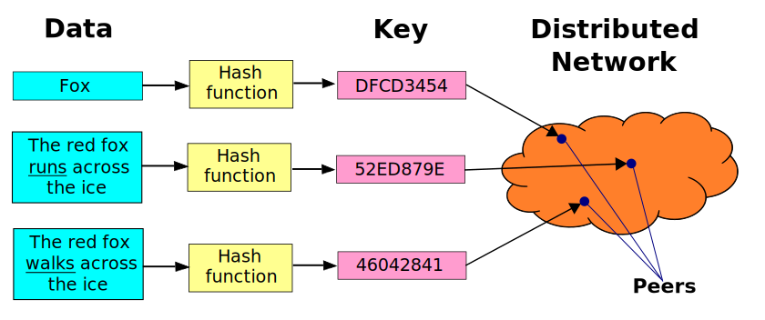

## Распределённая обработка информации и NoSQL СУБД

# Ангдеграунд

### Луцив Дмитрий Вадимович
### ЗАО «Ланит-Терком», СПбГУ

= = = = = = = = = = = = =

# К чему это всё?.. <!--.element: style="color: white;" -->

<!--.slide: data-background="images/int_catacombs_living.jpg" -->

- - - - - - - - - - - - -
## Многие забыли, с чего всё началось =)

<iframe width="560" height="315" src="https://www.youtube.com/embed/kV7ou6pl5wU" frameborder="0" allowfullscreen=""></iframe>

* Восторг от технологий
* Противопоставление прогресса и консерватизма
    * Неправильно (с моей точки зрения) истолкованная [Декларация независимости Киберпространства](https://www.eff.org/cyberspace-independence)

В итоге

* Где теперь одноранговая глобальная сеть?
* Где теперь сеть сотрудников НИИ и университетов?
    * Ну и военных тоже, ок

- - - - - - - - - - - - -
## В итоге нас всех опять делают одинаковыми

<!--.slide: data-background="images/epilogue_ussr_212.jpg" --> <!-- Убрал data-state="dimbg", отредактировал изображение -->

Примерно те же, кого поносят в Декларации =)<!--.element: style="text-align:center;" -->

- - - - - - - - - - - - -
## Добросовестность сервисов и лояльность пользователей

Типичные современные сервисы

В плане финансирования зависят от размера пользовательской базы и времени на сайте / в приложении:

* Следят, но не очень умело, за живостью пользователей
* Редко следят за истинной лояльностью пользователей
* Не всегда добросовестно
    * анализируют социальный граф
    * наращивают пользовательскую базу (когда друзявочки кому-то создают аккаунт)
    * используют темноту и примитивные инстинкты пользователей, задумавших перейти по внешней ссылке
    * относятся к приватным данным

Типичный аргумент пользователя:

* У всех есть
* Действительно нужные сообщества (пожалуй самый болезненный)
* Обязаловка (да бывает)
* Просто нравится общаться, а не думать про всякую чушь

- - - - - - - - - - - - -
## Чьи же на самом деле пользовательские данные?

* С одной стороны, в сбор этих данных вкладывали ресурсы корпорации и государства.
  В основном, законными, а иногда даже честными способами. Логично, что они после этого
  считают данные своими.
* С другой, люди ожидаемо часто оказываются недовольны и утверждают, что [данные принадлежат
  тому, кого они лично касаются](https://rublacklist.net/24094/).

- - - - - - - - - - - - -
## Чтобы хотя бы не усугублять ситуацию

В разной степени, и параноикам, и здоровым пользователям *периодически* хочется

* Контролировать физическое нахождение своих данных
    * Если нет, то чтобы никто не контролировал, но можно было шифровать
* Не пользоваться **пропиетарными** системами
* Не пользоваться **вендорозависимыми** системами
    * В идеале, не пользоваться **локально-вендорозависимыми системами**:
      если я поднял свой сервер со своим форумом, то я теперь не завишу от доброго дяди,
      но я сам теперь добрый дядя.

- - - - - - - - - - - - -
## Типичные подходы

<!-- .element: style="height:800px;" -->

Изменение топологии данных, хранимых сервисами на:

* Федеративную
* Одноранговую

= = = = = = = = = = = = =
# Федеративные <!-- .element: style="color: black;" -->

<!-- .slide: data-background="images/decentralized.png" -->

- - - - - - - - - - - - -
## Представители федеративных

* Обмен сообщениями
    * Email
    * [Fidonet](https://www.fidonet.org/) и FTN вообще
    * [XMPP (Jabber)](http://xmpp.org/) <!-- .element: style="color: blue;" -->
    * [Matrix](http://matrix.org/) <!-- .element: style="color: blue;" -->
* Учётные записи
    * [OpenID](http://openid.net/) <!-- .element: style="color: blue;" -->
    * [Oauth](https://oauth.net/)
* Социальные сети или что-то вроде
    * [Diaspora](https://diasporafoundation.org/) <!-- .element: style="color: red;" -->
    * [Friendica](http://friendica.com/) <!-- .element: style="color: red;" -->
    * [GNU Social](https://gnu.io/social/) <!-- .element: style="color: red;" -->
* Оверлейные сети
    * [Tor](https://www.torproject.org/) <!-- .element: style="color: red;" -->

= = = = = = = = = = = = =
# Одноранговые <!-- .element: style="color: black;" -->

<!-- .slide: data-background="images/p2p.jpg" -->

- - - - - - - - - - - - -
## Технологии одноранговых

* Одна из основных — [распределённая хеш-таблица](https://en.wikipedia.org/wiki/Distributed_hash_table)

<!-- .element: style="height:500px;" -->

* Различные сполсобы NAT traversal
* Часто — много шифрования %)

- - - - - - - - - - - - -
## Представители одноранговых

* Хранение данных, обмен данными
    * [BitTorrent](https://en.wikipedia.org/wiki/BitTorrent)
    * [FreeNet](https://freenetproject.org/) <!-- .element: style="color: red;" -->
    * [ZeroNet](https://zeronet.io/) (с подобием динамического контента) <!-- .element: style="color: red;" -->
    * [IPFS](https://ipfs.io/)
    * [RetroShare](http://retroshare.net/index.html) <!-- .element: style="color: red;" -->
    * [BlockChain](https://en.wikipedia.org/wiki/Blockchain_(database%29) <!-- .element: style="color: blue;" -->
* Оверлейные сети
    * [I2P](https://geti2p.net/) <!-- .element: style="color: red;" -->
* Сети с динамической топологией
    * [NetSukuku](http://netsukuku.freaknet.org/) <!-- .element: style="color: red;" -->
    * [Byzantium](http://project-byzantium.org/) <!-- .element: style="color: red;" -->
    * [Hyperboria](https://hyperboria.net/) <!-- .element: style="color: blue;" -->
* Обмен сообщениями
    * [Tox](https://tox.chat/) <!-- .element: style="color: red;" -->
    * [Ricochet](https://ricochet.im/) <!-- .element: style="color: red;" -->

= = = = = = = = = = = = =
# Совсем Underground — <!-- .element: style="color: black;" --> [Deaddrops](https://deaddrops.com/) <!-- .element: style="color: black;" -->

<!-- .slide: data-background="images/deaddrops1-600x400.jpg" -->

= = = = = = = = = = = = =
# Спасибо<!--.element: style="color: white;" -->

<!--.slide: data-background="images/epilogue_us.jpg" -->
